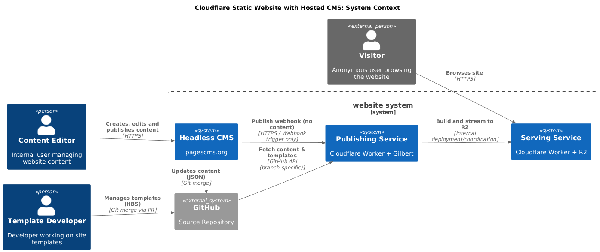
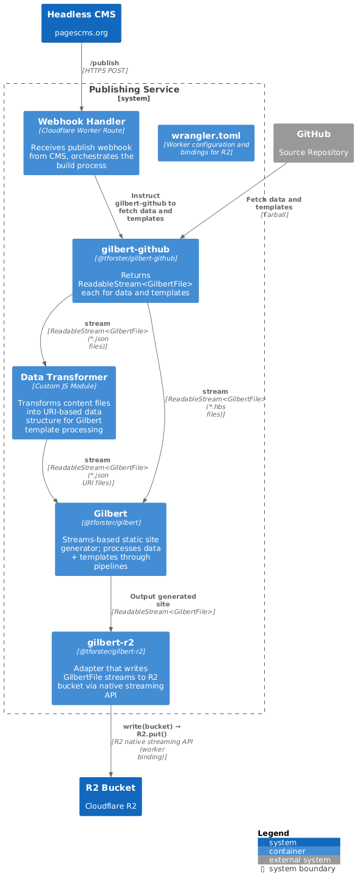
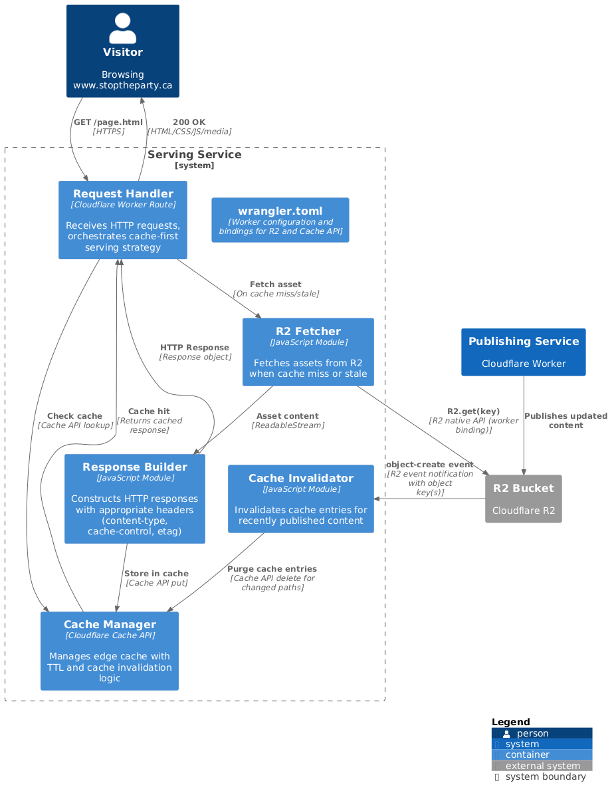

# How to Deploy to Cloudflare <!-- omit in toc -->

This guide demonstrates deploying a CMS-driven static site to Cloudflare using Gilbert and two separate Cloudflare Workers — one for publishing and one for serving.

## Table of Contents <!-- omit in toc -->

- [1. Prerequisites](#1-prerequisites)
- [2. System Architecture](#2-system-architecture)
- [3. Publishing Worker](#3-publishing-worker)
- [4. Serving Worker](#4-serving-worker)
- [5. Verification](#5-verification)
- [6. Troubleshooting](#6-troubleshooting)

## 1. Prerequisites

- A Cloudflare account with Workers and R2 enabled
- `wrangler` CLI installed: `npm install -g wrangler`
- GitHub repository used as the CMS content source
- Gilbert and gilbert-github installed in your project

## 2. System Architecture

The system uses two separate Cloudflare Workers. One handles publishing (triggered by CMS webhook) and one handles serving (responds to HTTP requests).



> [!NOTE]
> Worker static assets are not used here. Worker static assets are part of a worker deployment and we want to apply CMS changes without requiring a full worker deployment each time.

**Publishing service containers:**



**Serving service containers:**



The two-worker pattern decouples content generation from content delivery:

| Worker     | Trigger            | Responsibility                                                    |
| :--------- | :----------------- | :---------------------------------------------------------------- |
| Publishing | CMS webhook (POST) | Fetches content from GitHub, runs Gilbert, writes output to R2    |
| Serving    | HTTP request (GET) | Reads pre-generated files from R2 and returns them to the browser |

## 3. Publishing Worker

The publishing worker uses Gilbert's [content-only pipeline mode](../explanation/architecture.md#62-publishing-content-only-pipeline) — templates and static files only, no scripts or stylesheets (those are pre-built assets).

```javascript
// publishing-worker/index.js
import Gilbert from "@tforster/gilbert";
import GilbertGitHub from "@tforster/gilbert-github";
import GilbertR2 from "@tforster/gilbert-r2";

export default {
  async fetch(request, env) {
    if (request.method !== "POST") {
      return new Response("Method not allowed", { status: 405 });
    }

    try {
      const contentAdapter = new GilbertGitHub({
        repo: env.CONTENT_REPO,
        branch: "main",
        token: env.GITHUB_TOKEN,
      });

      const r2Adapter = new GilbertR2({ bucket: env.SITE_BUCKET });

      // Content-only pipeline — no scripts or stylesheets
      const gilbert = new Gilbert({
        templates: contentAdapter.read("templates/**/*.hbs"),
        data: { source: contentAdapter.read("data/**/*.json") },
      });

      await gilbert.compile().pipeTo(r2Adapter.write("/"));

      return new Response(JSON.stringify({ message: "Published successfully" }), {
        headers: { "Content-Type": "application/json" },
      });
    } catch (error) {
      return new Response(JSON.stringify({ error: error.message }), {
        status: 500,
        headers: { "Content-Type": "application/json" },
      });
    }
  },
};
```

## 4. Serving Worker

The serving worker reads pre-generated files from R2 and returns them with appropriate headers.

```javascript
// serving-worker/index.js
export default {
  async fetch(request, env) {
    const url = new URL(request.url);
    let path = url.pathname;

    // Resolve directory paths to index.html
    if (path.endsWith("/")) {
      path += "index.html";
    }

    const object = await env.SITE_BUCKET.get(path.slice(1));

    if (!object) {
      const notFound = await env.SITE_BUCKET.get("404.html");
      return new Response(notFound?.body ?? "Not found", {
        status: 404,
        headers: { "Content-Type": "text/html" },
      });
    }

    const headers = new Headers();
    object.writeHttpMetadata(headers);
    headers.set("ETag", object.httpEtag);

    return new Response(object.body, { headers });
  },
};
```

## 5. Verification

After deploying both workers:

1. Send a POST request to the publishing worker URL to trigger a build
2. Request a page from the serving worker URL to verify content is being served
3. Check the R2 bucket in the Cloudflare dashboard to confirm generated files are present

```bash
# Trigger a publish
curl -X POST https://publishing.your-subdomain.workers.dev

# Verify serving
curl https://serving.your-subdomain.workers.dev/index.html
```

## 6. Troubleshooting

**Worker exceeds CPU time limit** — switch to a Durable Object or a queue-based architecture for large sites. The content-only pipeline is fast (typically sub-200ms for moderate sites), but very large sites may hit CPU limits.

**R2 bucket permissions error** — ensure the binding in `wrangler.json` grants both read and write access to the publishing worker, and read-only access to the serving worker.

**Template not found** — verify that `webProducerKey` values in your data match actual template filenames in the GitHub repository.

[← Back to How-To Guides](./README.md)
